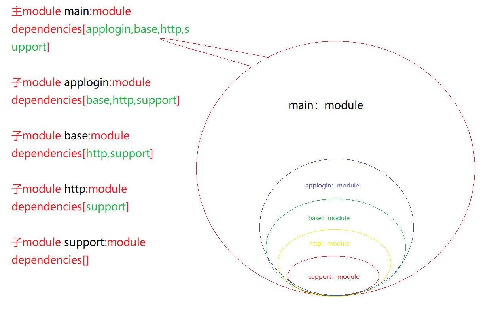

# TheIsle

#### 介绍

AndroidWork

#### 软件架构

软件架构说明

#### 安装教程

1. xxxx
2. xxxx
3. xxxx

#### 使用说明

1. xxxx
2. xxxx
3. xxxx

#### 参与贡献

1. Fork 本仓库
2. 新建 Feat_xxx 分支
3. 提交代码
4. 新建 Pull Request

#### 备忘

1. app:module 和 lib[]:module(主module与多个子module同时需要设置多渠道编译高版本gradle)
2. 例如我当前main:module主项目，applogin:module,base:module,http:module,support:module 四个子module ，首先要搞清楚各module依赖关系
3. 依赖关系如图：
4. 故此操作步骤如下
5. 工程的build.gradle 增加所有的依赖
6. moduleext.dimensions = [
   'main' : "main",
   'applogin': "applogin",
   'baselib': "baselib",
   'httplib': "httplib",
   'supportlib': "supportlib",
   ]
7. 最底层的supportlib：module并没有依赖，只需要申明 
   defaultConfig {
      flavorDimensions dimensions.supportlib
      }
    productFlavors {
           //开发环境
           PFdev {
                      dimension dimensions.supportlib
           }

           //测试环境
           PFTest {
                        dimension dimensions.supportlib
           }

           //正式环境
           PFrelease {
                        dimension dimensions.supportlib
           }
      }
      1. 上一层 http：module 依赖supportlib：module 需要申明并依赖
         defaultConfig {
         flavorDimensions dimensions.httplib
         }
   
            productFlavors {
            //开发环境
            PFdev {
         dimension dimensions.httplib
         missingDimensionStrategy dimensions.supportlib, "PFdev", "PFTest", "PFrelease"
          }

                    //测试环境
          PFTest {
                       dimension dimensions.httplib
                       missingDimensionStrategy dimensions.supportlib, "PFdev", "PFTest", "PFrelease"
          }

                    //正式环境
          PFrelease {
                       dimension dimensions.httplib
                       missingDimensionStrategy dimensions.supportlib, "PFdev", "PFTest", "PFrelease"
                    }
               }
8. main：module 如下
   defaultConfig {
   flavorDimensions dimensions.main
   }

   productFlavors {
   //开发环境
   PFdev {
   dimension dimensions.main
   missingDimensionStrategy dimensions.applogin, "PFdev", "PFTest", "PFrelease"
   missingDimensionStrategy dimensions.baselib, "PFdev", "PFTest", "PFrelease"
   missingDimensionStrategy dimensions.httplib, "PFdev", "PFTest", "PFrelease"
   missingDimensionStrategy dimensions.supportlib, "PFdev", "PFTest", "PFrelease"
   }

        //测试环境
        PFTest {
            dimension dimensions.main
            missingDimensionStrategy dimensions.applogin, "PFdev", "PFTest", "PFrelease"
            missingDimensionStrategy dimensions.baselib, "PFdev", "PFTest", "PFrelease"
            missingDimensionStrategy dimensions.httplib, "PFdev", "PFTest", "PFrelease"
            missingDimensionStrategy dimensions.supportlib, "PFdev", "PFTest", "PFrelease"
        }

        //正式环境
        PFrelease {
            dimension dimensions.main
            missingDimensionStrategy dimensions.applogin, "PFdev", "PFTest", "PFrelease"
            missingDimensionStrategy dimensions.baselib, "PFdev", "PFTest", "PFrelease"
            missingDimensionStrategy dimensions.httplib, "PFdev", "PFTest", "PFrelease"
            missingDimensionStrategy dimensions.supportlib, "PFdev", "PFTest", "PFrelease"
        }

   }

#### 特技

1. 使用 Readme\_XXX.md 来支持不同的语言，例如 Readme\_en.md, Readme\_zh.md
2. Gitee 官方博客 [blog.gitee.com](https://blog.gitee.com)
3. 你可以 [https://gitee.com/explore](https://gitee.com/explore) 这个地址来了解 Gitee 上的优秀开源项目
4. [GVP](https://gitee.com/gvp) 全称是 Gitee 最有价值开源项目，是综合评定出的优秀开源项目
5. Gitee 官方提供的使用手册 [https://gitee.com/help](https://gitee.com/help)
6. Gitee 封面人物是一档用来展示 Gitee 会员风采的栏目 [https://gitee.com/gitee-stars/](https://gitee.com/gitee-stars/)
7. 多渠道打包，子module 多渠道
   思路 [https://blog.csdn.net/z470567554/article/details/103896625](https://blog.csdn.net/z470567554/article/details/103896625)
8. modulesBase:libBase 可以为添加双层结构的在new module的时候输入的module名字
