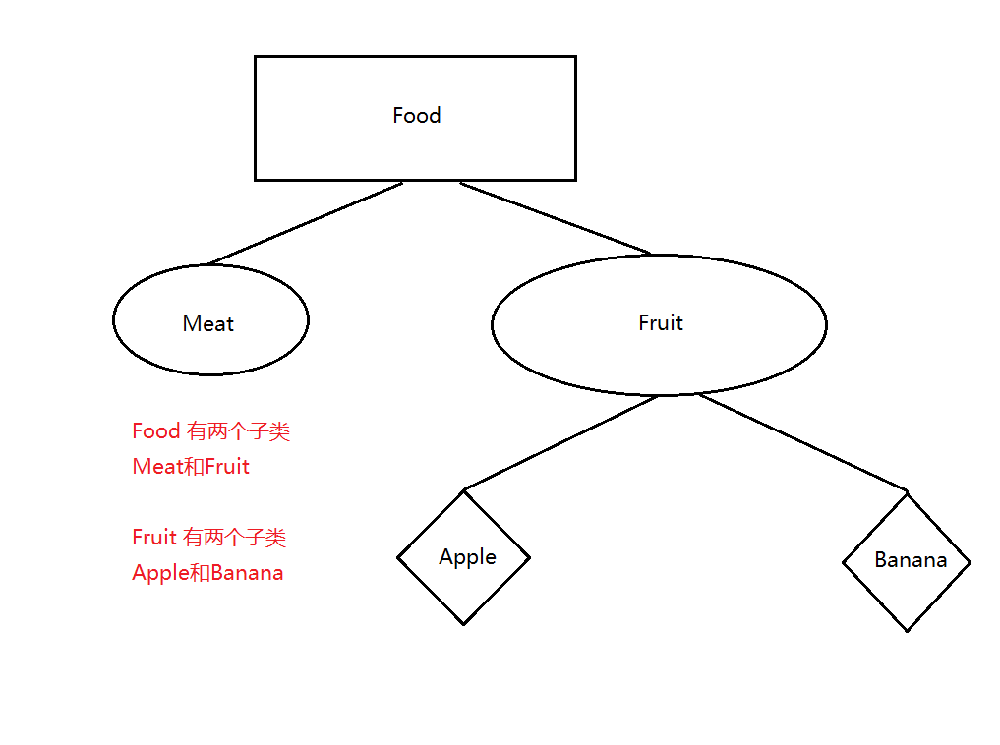

## 泛型 上界通配符 下界通配符 协变 逆变

#### 一：介绍

AndroidWork:主要对泛型进行解释说明 需要准备一些基础类如下有 Food Meat Fruit Apple Banana 如图说明他们关系


````
    public abstract class Food {
        abstract String name();
    }

    public class Meat extends Food {
        @Override
        String name() {
            return "Meat";
        }
    }

    public class Fruit extends Food {
        @Override
        String name() {
            return "Fruit";
        }
    }

    public class Apple extends Fruit {
        @Override
        String name() {
            return "Apple";
        }
    }

    public class Banana extends Fruit {
        @Override
        String name() {
            return "Banana";
        }
    }
````

#### 二：关键字说明

1. 泛型 泛型是一种不需要确定具体数据类型的定义，编译会自动对泛型进行转换，可以方便我们在编程的时候减少很多重复代码，同时增加安全性（区别于Object，object是超级父类）
2. = Class 下定义时以及初始化时说明，=左边为<font color= red> 下定义时 </font>，=右边为 <font color= red> 实例化时 </font>
   ，下一行之后都是<font color= red> 初始化后 </font>
3. 上界通配符
    * Java: <? extends T> （<font color= red> 实例化时 </font>泛型中的类型只能是T以及子类，同时可以存输入参数值;<font color= red>
      初始化后 </font> 只能取输出返回值，不可以再存输入参数值）
      > <font color= red> 下定义时 </font>的泛型 ？,在<font color= red> 实例化时 </font>泛型只能是当前类T及其子类，在<font color= red> 初始化后 </font>只能输出返回值，不能在实<font color= red> 初始化后 </font>存放数据，存放数据需要放在<font color= red> 实例化时 </font> 即是 <font color= red> Class(){{存放数据}} </font>，代码如下
      ````
        List<? extends Food> foods = new ArrayList<Fruit>() {{
            //数据初始化
            /* add(new Food(){
                 @Override
                 String name() {
                     return "Food";
                 }
             });*///报错
             add(new Fruit());
             add(new Apple());
             // add(new Meat());报错
         }};
         // 初始化再存放数据时会报错
         // foods.add(new Fruit());  报错
         // foods.add(new Apple());  报错
         // foods.add(new Meat());   报错
      
         //获取输出实例 默认是Object
         Object obj = foods.get(0);
         
         //获取输出实例 当需要指定类型的时候需要进行强转，但是强转就可能会带来类型转换异常的错误（get(1)是Apple）
         Fruit fruit = (Fruit) foods.get(0);
      ````
      > 如上代码清晰说明了泛型？，  
      那么问题来了上界通配符的上界是什么意思会在泛型中有什么影响？
      ````
      List<? extends Food> foods = new ArrayList<Fruit>();
      ````
      例子中的? extends Food <font color= red> 下定义时 </font>上界 是Food，<font color= red> 实例化时 </font>
      泛型是Fruit，Fruit是Food的子类  
      结果<font color= red> 实例化时 </font> 存放数据实例类型受限于<font color= red> 实例化时 </font>
      的泛型是Fruit，只能存放Fruit及其子类，而不是 <font color= red> 下定义时 </font>的泛型Food 故此若将<font color= red>
      实例化时 </font>的泛型
      > 改为Food如下
      ````
      List<? extends Food> foods = new ArrayList<Food>()
      ````
      ```` 
      List<? extends Food> foods = new ArrayList<Food>() {{
            add(new Food() {
                @Override
                String name() {
                    return "Food";
                }
            });
            add(new Fruit());
            add(new Apple());
            add(new Meat());
      }};
      ````
      > 此时Food及其子类全都可以在<font color= red> 实例化时 </font>存放，不会出现报错信息  
      总结：<font color= red> 实例化时 </font> 的泛型受限于<font color= red> 下定义时 </font>的泛型，<font color= red> 实例化时 </font> 存放数据类型受限于<font color= red> 实例化时 </font>泛型

    * Kotlin 中的out:T 协变 可输出返回值fun get():T，不可以输入参数fun set(t:T)）
4. 下界通配符
    * Java:<? super T> (<font color= red> 实例化时 </font>泛型中的类型只能是T及其父类，<font color= red>
      实例化时 </font><font color= red> 初始化后 </font>两个过程均可以存取实例)
   > <font color= red> 下定义时 </font>的泛型？ 在<font color= red> 实例化时 </font> 和<font color= red> 初始化后 </font> 添加对象类型限制是不同的，<font color= red> 初始化后 </font>添加对象只能是<font color= red> 下定义时 </font>T及其子类，<font color= red> 实例化时 </font> 添加对象时的类型只能是<font color= red> 实例化时 </font> 类型及其子类的我们可以将两个看作都有各自的作用域代码如下  
   ````
         List<? super Fruit> fruits = new ArrayList<Food>() {{
            //add(new Object()) 报错
            add(new Apple());
            add(new Food() {
                @Override
                String name() {
                    return null;
                }
            });
            //正常添加 Meat和Fruit均为Food的子类，但此时的作用域却是<font color= red> 实例化时 </font>Food类型下，而不受<font color= red> 下定义时 </font> T类型限制
            add(new Meat());
            add(new Fruit());
            Object object = get(0);
        }};
        // fruits = new ArrayList<Apple>(); 报错
        // fruits = new ArrayList<Banana>(); 报错
        fruits.add(new Apple());
        //fruits.add(new Food()); 报错
        fruits.add(new Banana());
        fruits.add(new Fruit());
        //报错 <font color= red> 初始化后 </font> 作用域发生改变，添加对象受到<font color= red> 下定义时 </font> T类型限制  
        //fruits.add(new Meat());
        Apple apple = (Apple) fruits.get(0);
        Object object = fruits.get(0);
   ````

#### 参考文献

1. [Java 泛型中extends和super的区别](https://zhuanlan.zhihu.com/p/249187830)
2. [Java 泛型中的extends和super理解](https://blog.csdn.net/qq_33561055/article/details/87289812)
3. [Kotlin (out)协变和(in)逆变](https://www.bilibili.com/video/BV1wf4y1s7TG?p=113)
4. [URL](URL)

#### 表格图解


